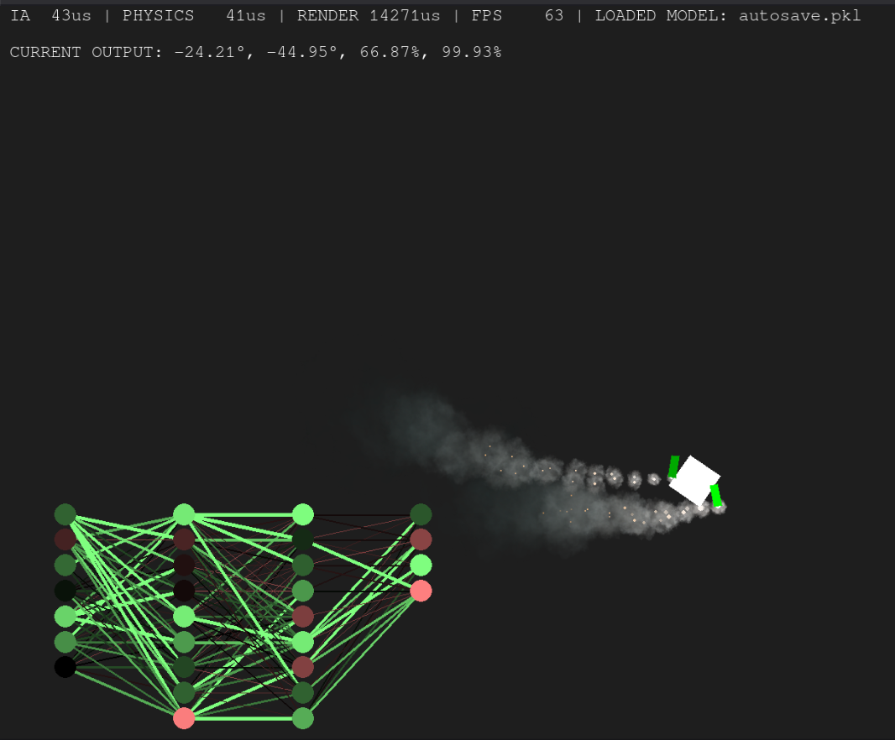

# Drone controller using a Genetic Algorithm

## Usage
Launch `main.py` with the following flags (ex: `.venv/bin/python3.13 main.py -train 0 -play 1 -resume 0`):
- **train**: 1 / 0, def: 0 $\to$ runs the training algorithm (specify hyperparameters inside the `main.py` and `arena.py`)
    ```python
    # main.py
    W, H = 2000, 1000
    force_no_render = True
    visual_update = 4
    dt_frame = 1
    elapsed = 0
    running = True

    N_agents = 2 ** 10
    max_training_steps = 1800
    N_epoch = 2 ** 15

    wavepoints = [[0.5 * W, 0.5 * H]]
    wavepoints.extend([[random() * W, random() * H] for i in range(50)])
    ```
    ```python
    # arena.py
    ELITES = max(4, int(self.n_agents * 0.1))
    TOURNAMENT_K = 5

    MUT_P = 0.05          # per-parameter mutation probability
    MUT_SIGMA = 0.2      # mutation std
    W_MAX = 3.0           # weight/bias clamp
    ```
- **play**: 1 / 0, def: 1 $\to$ runs the best model to play with (specify which model inside the `main.py`)
    ```python
    # main.py
    loaded_model = 'autosave.pkl'
    # loaded_model = 'finished_training.pkl'
    # loaded_model = 'new.pkl'
    ```
- **resume**: 1 / 0, def: 0 $\to$ resumes last training cloning N times the best model (specify which model to resume inside the `main.py`)
    ```python
    if RESUME:
        print("Resuming training...")
        arena = Arena(N_agents, N_epoch, max_training_steps, [W/2, H/2])
        agent = arena.load_best_NN('autosave.pkl')
        arena.populate_with_loaded_NN(agent)
    ```

## Screenshot:


## Future projects:
I would like to add C / CUDA support to make the training even faster. Also add a more interesting model of the Drone would be nice.